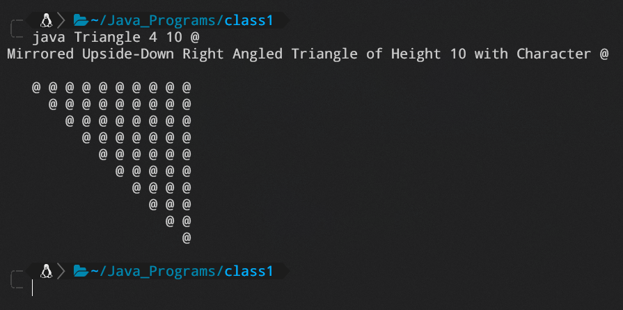

# Java CLI ASCII Triangle Patterns

A simple java program that contains triangle patterns, written in java.

## Requirements for Installation

### Java
1. [Java JDK](https://www.oracle.com/java/technologies/downloads/)
2. Set the paths (watch a YouTube video)

### Clone this repo
```bash
git clone https://github.com/Debaloy/java-cli-triangle-patterns.git
```

## Usage
### Compilation
Open the folder where you cloned the repo and type the following:

```bash
javac Triangle.java
```

### Working
Get started by typing,
```bash
java Triangle --help
```
This will show all the available combination of commands.

### Example:
```bash
java Triangle 4 10 @
```
4 means it will print a mirrored upside down right triangle.\
10 means the triangle will be 10 lines long.\
```@``` means the triangle will be made of this character. [ Default is ```*``` ].\
Like so:\


## License
[MIT](LICENSE.txt)
